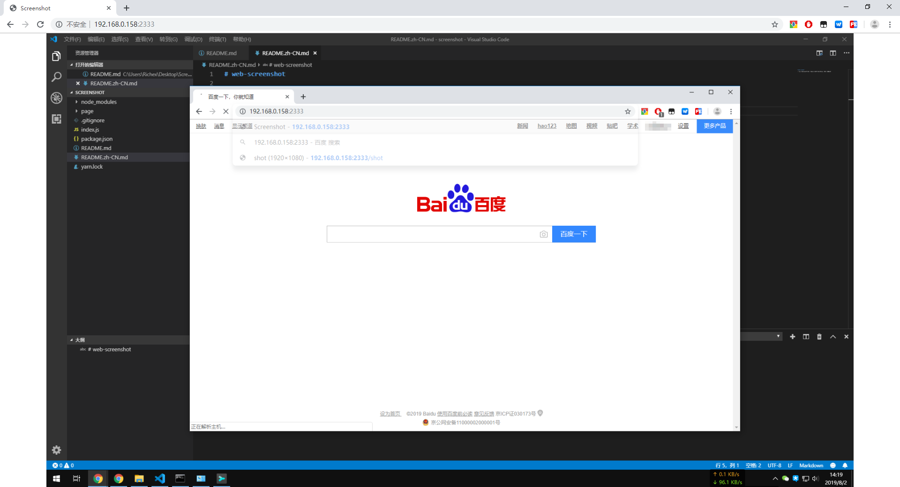

# web-screenshot

This is a remote screen viewing tool for Windows that looks at the screen display without a remote connection.




### Use

```
node index.js
```

Run above command, Then open `http://localhost:2333/` in your browser.

