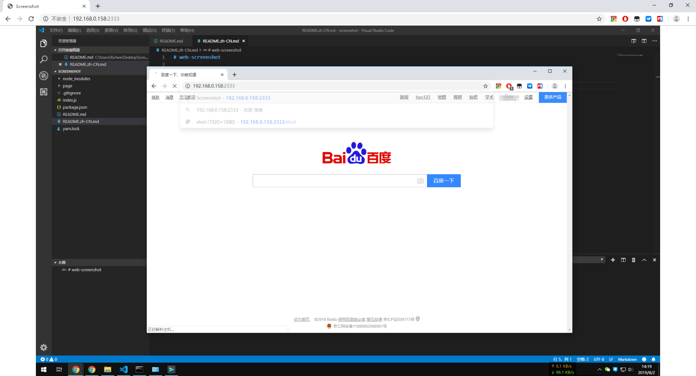

# web-screenshot

[英文](/README.md) / [GitHub](https://github.com/richex-cn/web-screenshot) / [码云](https://gitee.com/Richex/web-screenshot)

这是一个用于Windows的远程屏幕查看工具，用于在不进行远程连接的情况下查看屏幕显示内容。




### Use

```
node index.js
```

运行以上命令，然后在浏览器中打开 `http://localhost:2333/`

网页每10秒会自动刷新一次，当然你也可以手动刷新页面。
